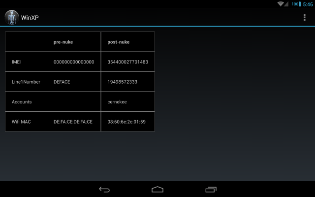

Win XPrivacy
============

This is a proof of concept that illustrates how to bypass
[XPrivacy](http://forum.xda-developers.com/xposed/modules/test-xprivacy-2-0-37-ultimate-privacy-t2320783)
restrictions using JNI.

XPrivacy is a third-party permission manager for Android which is used to
prevent semi-untrusted apps from gathering certain types of user data.  A
typical use case might involve allowing a social networking app to access
the internet, but prohibiting it from scanning through call logs or
activating the microphone or camera.

What many XPrivacy users do not realize is that the XPrivacy protections are
less strict than the permissions built into the standard Android OS.  XPrivacy,
for the sake of compatibility with "skinned" Android implementations that
change and/or obfuscate the AOSP internals, enforces its restrictions from
inside the same process it is trying to block.  Therefore, it is often possible
for an uncooperative app to bypass the XPrivacy protections using native code,
reflection, local reimplementation of the SDK APIs, or other trickery.

The Android OS, by contrast, enforces its permissions inside the service.
OS services run in a separate process under a different UID, so it is harder
to trick them into doing something inappropriate.

In this project, the JNI code implementing the bypass lives in jni/facebook.cpp
(aka: libfacebook.so).  The basic idea here is that a large, complex app that
makes heavy use of JNI, such as
[com.facebook.katana.apk](https://play.google.com/store/apps/details?id=com.facebook.katana&hl=en), could easily slip in a
function that neutralizes XPrivacy.  Blocking JNI will work around the issue,
but in that case the app no longer runs - rendering XPrivacy no more effective
than traditional Android permission editors like
[Permissions Denied](https://play.google.com/store/apps/details?id=com.stericson.permissions.donate&hl=en).

The current implementation, nukeXposed(), manipulates internal Dalvik data
structures to remove any Xposed hooks on the classes specified by the caller.
It does this by iterating through the list of methods known to the VM, and
looking for any methods marked as native.  This is a crude heuristic that
assumes that most standard Android SDK APIs are implemented in Java.
When Xposed hooks a method, it marks it as native and then injects a function
pointer to its own C++ xposedCallHandler().  xposedCallHandler() invokes
handleHookedMethod() from XposedBridge.java when the victim method is executed.
This entire mechanism is bypassed when the original method's flags and settings
are restored by nukeXposed().

Another approach might involve calling XposedBridge.unhookMethod() instead
of directly manipulating the Method struct in C++.  I was not able to obtain
a reference to this class, possibly owing to the fact that it is loaded very
early in the VM's lifecycle.

This research was closely coordinated with M66B, the author of XPrivacy.
He posted a writeup [here](http://forum.xda-developers.com/showpost.php?p=54111452&postcount=10580)
describing the efforts to date and possible future direction.

## Screenshots

## API example

To delete the XPrivacy hooks from ContextImpl.getSystemService() and from
the various TelephonyManager methods, just call the JNI code when the app
starts up:

    Native.nukeXposed("android/app/ContextImpl");
    Native.nukeXposed("android/telephony/TelephonyManager");

If XPrivacy/Xposed are not present, none of these methods will be marked
as native, and these calls will have no effect.

## Building from source

Install the Android NDK and SDK, then:

    android update project -p .
    ndk-build
    ant debug
    adb install -r bin/WinXP-debug.apk
